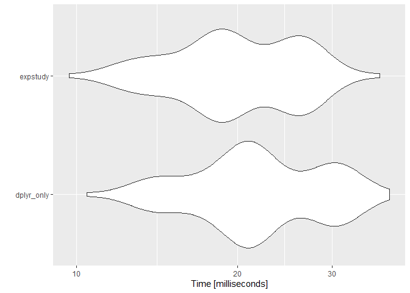

<!-- README.md is generated from README.Qmd. Please edit that file -->

# expstudy <a href="https://cb12991.github.io/expstudy/"></a>

<!-- badges: start -->

[](https://CRAN.R-project.org/package=expstudy)
[](https://github.com/cb12991/expstudy/actions/workflows/R-CMD-check.yaml)
[](https://github.com/cb12991/expstudy/actions/workflows/test-coverage.yaml)
[](https://app.codecov.io/gh/cb12991/expstudy?branch=main)
[](http://www.r-pkg.org/pkg/expstudy)
<!-- badges: end -->

The goal of expstudy is to provide a set of tools to quickly conduct
analysis of an experience study. Commonly used techniques (such as
actual-to-expected analysis) are generalized and streamlined so that
repetitive coding is avoided.

Most analyses for an experience study is structured around *measures*
for a particular decrement of interest, e.g., the number of policy
surrenders for a surrender experience study. For any given decrement of
interest, the following measures are commonly utilized:

- **Actuals**: the actual decrement count (or amount) observed
- **Exposures**: the number of policies or the face amount of insurance
  exposed to the decrement of interest
- **Expecteds**: the expected decrement count or amount per unit of
  exposure
- **Variances**: the expectation variance of an underlying assumption
  for the expecteds of the study (used primarily for confidence
  intervals and credibility scores)

expstudy provides functions to recognize or identify study measures so
that the routine analyses can be streamlined.

# Installation

expstudy is published to CRAN so you can download directly from any CRAN
mirror:

``` r
install.packages('expstudy')
```

## Development version

To get a bug fix or to use a feature from the development version, you
can install the development version of expstudy from GitHub.

``` r
# Uncomment below if you do not have pak installed yet.
# install.packages('pak')
pak::pak('cb12991/expstudy')
```

# Usage

``` r
library(expstudy)
```

This package provides a sample mortality experience study to aid with
examples:

``` r
dplyr::glimpse(mortexp)
#> Rows: 176,096
#> Columns: 23
#> $ AS_OF_DATE            <date> 1998-04-30, 1998-05-31, 1998-06-30, 1998-07-31,…
#> $ POLICY_HOLDER         <fct> PH_0001, PH_0001, PH_0001, PH_0001, PH_0001, PH_…
#> $ GENDER                <fct> FEMALE, FEMALE, FEMALE, FEMALE, FEMALE, FEMALE, …
#> $ SMOKING_STATUS        <fct> NON-SMOKER, NON-SMOKER, NON-SMOKER, NON-SMOKER, …
#> $ UNDERWRITING_CLASS    <fct> STANDARD, STANDARD, STANDARD, STANDARD, STANDARD…
#> $ FACE_AMOUNT           <dbl> 5000, 5000, 5000, 5000, 5000, 5000, 5000, 5000, …
#> $ INSURED_DOB           <date> 1977-01-20, 1977-01-20, 1977-01-20, 1977-01-20,…
#> $ ISSUE_DATE            <date> 1998-04-02, 1998-04-02, 1998-04-02, 1998-04-02,…
#> $ TERMINATION_DATE      <date> 2013-08-08, 2013-08-08, 2013-08-08, 2013-08-08,…
#> $ ISSUE_AGE             <dbl> 20, 20, 20, 20, 20, 20, 20, 20, 20, 20, 20, 20, …
#> $ ATTAINED_AGE          <dbl> 22, 22, 22, 22, 22, 22, 22, 22, 22, 23, 23, 23, …
#> $ EXPECTED_MORTALITY_RT <dbl> 0.01020408, 0.01020408, 0.01020408, 0.01020408, …
#> $ POLICY_DURATION_YR    <dbl> 1, 1, 1, 1, 1, 1, 1, 1, 1, 1, 1, 1, 2, 2, 2, 2, …
#> $ POLICY_DURATION_MNTH  <int> 1, 2, 3, 4, 5, 6, 7, 8, 9, 10, 11, 12, 13, 14, 1…
#> $ POLICY_STATUS         <fct> SURRENDERED, SURRENDERED, SURRENDERED, SURRENDER…
#> $ MORT_EXPOSURE_CNT     <dbl> 0.07671233, 0.08219178, 0.07945205, 0.08219178, …
#> $ MORT_EXPOSURE_AMT     <dbl> 383.5616, 410.9589, 397.2603, 410.9589, 410.9589…
#> $ MORT_ACTUAL_CNT       <dbl> 0, 0, 0, 0, 0, 0, 0, 0, 0, 0, 0, 0, 0, 0, 0, 0, …
#> $ MORT_ACTUAL_AMT       <dbl> 0, 0, 0, 0, 0, 0, 0, 0, 0, 0, 0, 0, 0, 0, 0, 0, …
#> $ MORT_EXPECTED_CNT     <dbl> 0.0007827789, 0.0008386916, 0.0008107353, 0.0008…
#> $ MORT_EXPECTED_AMT     <dbl> 3.913894, 4.193458, 4.053676, 4.193458, 4.193458…
#> $ MORT_VARIANCE_CNT     <dbl> 0.0007821661, 0.0008379882, 0.0008100780, 0.0008…
#> $ MORT_VARIANCE_AMT     <dbl> 19554.15, 20949.71, 20251.95, 20949.71, 20949.71…
```

Assumptions within an experience study are often evaluated via
actual-to-expected (AE) ratios. The aggregate assumption performance can
be reviewed by totaling up the actuals and dividing by the total
expecteds to produce the AE ratio. An AE ratio close to 100% signifies
the expectation using the underlying assumption reflects actual
policyholder behavior observed in experience.

Calculating the aggregate AE ratio without expstudy (with the help of
the tidyverse/dplyr package) is shown below:

``` r
library(dplyr)
mortexp %>%
  summarise(
    across(
      .cols = c(
        MORT_EXPOSURE_CNT, MORT_ACTUAL_CNT, MORT_EXPECTED_CNT, 
        MORT_VARIANCE_CNT, MORT_EXPOSURE_AMT, MORT_ACTUAL_AMT, 
        MORT_EXPECTED_AMT, MORT_VARIANCE_AMT
      ),
      .fns = \(x) sum(x, na.rm = TRUE)
    )
  ) %>%
  mutate(
    CNT_AE_RATIO = MORT_ACTUAL_CNT / MORT_EXPECTED_CNT,
    AMT_AE_RATIO = MORT_ACTUAL_AMT / MORT_EXPECTED_AMT
  ) %>%
  glimpse
#> Rows: 1
#> Columns: 10
#> $ MORT_EXPOSURE_CNT <dbl> 14295.43
#> $ MORT_ACTUAL_CNT   <dbl> 315
#> $ MORT_EXPECTED_CNT <dbl> 256.4227
#> $ MORT_VARIANCE_CNT <dbl> 255.9583
#> $ MORT_EXPOSURE_AMT <dbl> 210257356
#> $ MORT_ACTUAL_AMT   <dbl> 4650000
#> $ MORT_EXPECTED_AMT <dbl> 3843358
#> $ MORT_VARIANCE_AMT <dbl> 148007176380
#> $ CNT_AE_RATIO      <dbl> 1.22844
#> $ AMT_AE_RATIO      <dbl> 1.20988
```

Using expstudy, the code to produce the same output is as follows:

``` r
mortexp %>% summarise_measures %>% mutate_metrics %>% glimpse
#> Rows: 1
#> Columns: 18
#> $ MORT_ACTUAL_CNT   <dbl> 315
#> $ MORT_EXPOSURE_CNT <dbl> 14295.43
#> $ MORT_EXPECTED_CNT <dbl> 256.4227
#> $ MORT_VARIANCE_CNT <dbl> 255.9583
#> $ MORT_ACTUAL_AMT   <dbl> 4650000
#> $ MORT_EXPOSURE_AMT <dbl> 210257356
#> $ MORT_EXPECTED_AMT <dbl> 3843358
#> $ MORT_VARIANCE_AMT <dbl> 148007176380
#> $ AVG_OBSRV_CNT     <dbl> 0.02203501
#> $ AVG_EXPEC_CNT     <dbl> 0.01793739
#> $ CI_FCTR_CNT       <dbl> 0.002193488
#> $ AE_RATIO_CNT      <dbl> 1.22844
#> $ CREDIBILITY_CNT   <dbl> 0.4088781
#> $ AVG_OBSRV_AMT     <dbl> 0.02211575
#> $ AVG_EXPEC_AMT     <dbl> 0.0182793
#> $ CI_FCTR_AMT       <dbl> 0.003586231
#> $ AE_RATIO_AMT      <dbl> 1.20988
#> $ CREDIBILITY_AMT   <dbl> 0.2548539
```

The runtimes of each do not significantly differ, so there is no
performance degradation with the code improvement:

``` r
library(microbenchmark)
library(ggplot2)
autoplot(microbenchmark(
  dplyr_only = mortexp %>%
  summarise(
    across(
      .cols = c(
        MORT_EXPOSURE_CNT, MORT_ACTUAL_CNT, MORT_EXPECTED_CNT, 
        MORT_VARIANCE_CNT, MORT_EXPOSURE_AMT, MORT_ACTUAL_AMT, 
        MORT_EXPECTED_AMT, MORT_VARIANCE_AMT
      ),
      .fns = \(x) sum(x, na.rm = TRUE)
    )
  ) %>%
  mutate(
    CNT_AE_RATIO = MORT_ACTUAL_CNT / MORT_EXPECTED_CNT,
    AMT_AE_RATIO = MORT_ACTUAL_AMT / MORT_EXPECTED_AMT
  ),
  expstudy = mortexp %>% summarise_measures %>% mutate_metrics
))
```


Note that expstudy is calculating more than the AE ratio metric. Without
those additional metrics, performance with expstudy actually surpasses
performance without:

``` r
autoplot(microbenchmark(
  dplyr_only = mortexp %>%
  summarise(
    across(
      .cols = c(
        MORT_EXPOSURE_CNT, MORT_ACTUAL_CNT, MORT_EXPECTED_CNT, 
        MORT_VARIANCE_CNT, MORT_EXPOSURE_AMT, MORT_ACTUAL_AMT, 
        MORT_EXPECTED_AMT, MORT_VARIANCE_AMT
      ),
      .fns = \(x) sum(x, na.rm = TRUE)
    )
  ) %>%
  mutate(
    CNT_AE_RATIO = MORT_ACTUAL_CNT / MORT_EXPECTED_CNT,
    AMT_AE_RATIO = MORT_ACTUAL_AMT / MORT_EXPECTED_AMT
  ),
  expstudy = mortexp %>% 
    summarise_measures %>%
    mutate_metrics(
      metrics = list(AE_RATIO = ae_ratio)
    )
))
```



Whenever there is not enough credibility for a company to write their
own assumption, adjustment factors are often used to incorporate
emerging experience. expstudy provides a function to determine factor
adjustments for each provided set of measures using a variety of
methods.

``` r
mortexp %>%
  group_by(
    GENDER,
    SMOKING_STATUS
  ) %>%
  compute_fct_adjs(
    expected_rate = EXPECTED_MORTALITY_RT,
    amount_scalar = FACE_AMOUNT,
    method = 'sequential'
  )
#> $CNT
#>   SMOKING_STATUS GENDER GENDER_FCT_ADJ SMOKING_STATUS_FCT_ADJ COMPOSITE_FCT_ADJ
#> 1     NON-SMOKER FEMALE       1.271511              1.0194734          1.296272
#> 2     NON-SMOKER   MALE       1.193514              1.0194734          1.216755
#> 3         SMOKER FEMALE       1.271511              0.9515988          1.209968
#> 4         SMOKER   MALE       1.193514              0.9515988          1.135746
#> 
#> $AMT
#>   SMOKING_STATUS GENDER GENDER_FCT_ADJ SMOKING_STATUS_FCT_ADJ COMPOSITE_FCT_ADJ
#> 1     NON-SMOKER FEMALE       1.307949               0.998288          1.305710
#> 2     NON-SMOKER   MALE       1.129454               0.998288          1.127520
#> 3         SMOKER FEMALE       1.307949               1.004059          1.313259
#> 4         SMOKER   MALE       1.129454               1.004059          1.134039
```

Refer to each function’s documentation page for additional detail.

# Code of Conduct

Please note that the expstudy project is released with a [Contributor
Code of
Conduct](https://cb12991.github.io/expstudy/CODE_OF_CONDUCT.html). By
contributing to this project, you agree to abide by its terms.
